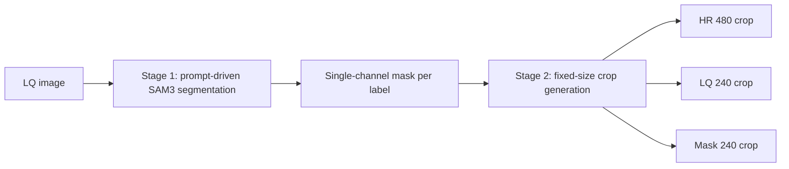

# sam3-mask

Prompt-driven mask and crop extraction for paired super-resolution datasets.

The project now supports a two-stage dataset workflow on paired `LQ/HR` images:

1. Stage 1 writes one aggregate single-channel mask per `(image, label)` under `output/masks/...`
2. Stage 2 reads the saved masks and exports fixed-size `HR/LQ/mask` crops under `output/crops/...`

Multiple detected instances for the same label are merged into one mask. If nothing is detected for a label, an empty mask is still saved.

## Two-Stage Overview



## Visual Examples

### Face Example

| LQ Input | HR Input |
|---|---|
|  |  |

| Stage 1 Face Mask | Stage 2 HR Crop | Stage 2 LQ Crop | Stage 2 Mask Crop |
|---|---|---|---|
|  |  |  |  |

### Plant Example

| LQ Input | HR Input |
|---|---|
|  |  |

| Stage 1 Plant Mask | Stage 2 HR Crop | Stage 2 LQ Crop | Stage 2 Mask Crop |
|---|---|---|---|
|  |  |  |  |

## Why Two Stages

- Stage 1 saves masks once, so crop strategy changes do not require rerunning SAM3.
- Stage 2 is deterministic from saved masks and is convenient for dataset patch generation.
- One label produces one aggregate mask per image, even when that image contains multiple instances.

## Requirements

- Python 3.10+
- Windows or Linux

## Install

```bash
python -m pip install -e .[dev]
```

For quick source-tree execution without installing, use:

```powershell
$env:PYTHONPATH = "src"
python -m sam3_mask.main --config configs/default.yaml
```

## Config

The default runtime config lives at `configs/default.yaml`.

Important options:

- `input.lq_dir` and `input.hr_dir`: paired dataset roots
- `prompts.labels`: label prompts such as `face`, `plant`, `architecture`
- `pipeline.stage`: `mask` or `crop`
- `crop.hr_crop_size`: fixed HR crop size, default `480`
- `pairing.expected_scale`: expected HR/LQ scale, default `2.0`
- `model.backend`: `dummy` locally, `sam3` when the SAM3 dependency stack is installed
- `model.checkpoint`: local checkpoint path such as `D:/repository/sam3-mask/sam3.pt`

CLI overrides:

```powershell
$env:PYTHONPATH = "src"
python -m sam3_mask.main --config configs/default.yaml --labels face plant
```

## Output

The pipeline writes label-scoped masks and crops plus manifests:

```text
output/
  masks/<label>/<relative_dir>/<filename>.png
  crops/<label>/hr_480/<relative_dir>/<filename>__r{row}_c{col}.png
  crops/<label>/lq_240/<relative_dir>/<filename>__r{row}_c{col}.png
  crops/<label>/mask_240/<relative_dir>/<filename>__r{row}_c{col}.png
  manifests/
    pairs.csv
    objects.jsonl
    summary.json
```

Notes:

- `manifests/summary.json` and `objects.jsonl` are rewritten on each run
- shared output roots are safe for `masks/<label>` and `crops/<label>`, but manifests are not label-scoped

## Local Verification

```powershell
$base = Join-Path $env:TEMP ('codex-pytest-' + [guid]::NewGuid().ToString())
python -m pytest tests/test_pipeline_dummy.py -v -p no:cacheprovider --basetemp=$base
```

Current expected result: all tests pass.

## SAM3 Backend

After installing the SAM3 dependency stack and placing a local checkpoint, run stage 1 and stage 2 separately:

```powershell
python -m sam3_mask.main --config configs/SR_HR_.yaml
python -m sam3_mask.main --config configs/SR_HR_crop.yaml
```

## Example Configs

The repository includes ready-to-run configs for the current dataset:

- `configs/SR_HR_.yaml`: shared labels mask stage
- `configs/SR_HR_crop.yaml`: shared labels crop stage
- `configs/SR_HR_plant.yaml` / `configs/SR_HR_plant_crop.yaml`: plant-only output root
- `configs/SR_HR_face_shared.yaml` / `configs/SR_HR_face_shared_crop.yaml`: face in shared output root
- `configs/SR_HR_plant_shared.yaml` / `configs/SR_HR_plant_shared_crop.yaml`: plant in shared output root
- `configs/SR_HR_architecture_shared.yaml` / `configs/SR_HR_architecture_shared_crop.yaml`: architecture in shared output root

## Notes

- The package uses a `src/` layout.
- `sam3.pt` is intentionally ignored by git.
- Stage 2 reads masks from the configured output root; run stage 1 first.
- Real CPU inference with SAM3 is expected to be slow; use GPU for practical runs.
